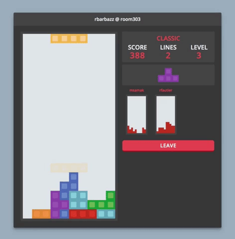

# Red Tetris
> Everyone knows the Tetris Game and everyone knows Javascript, it only remains to build a Tetris in Javascript.

Red Tetris is part of the web branch at 42 Paris. This project is an online multiplayer Tetris game in full stack Javascript. The game follows the official Tetris guidelines.

The front end was written using React and Redux and implemented in functional programming. On the other hand, the Node JS back end uses OOP.
The client and the server communicate through a websocket.



Features:
- Solo/Multiplayer game
- Lobby and room system
- Spectator mode
- Spectrums
- Code coverage over 70%
- Connection with a hash-based url → ```#roomname[username]```

A [hosted](https://redtetris-42.herokuapp.com/) version of the program is available, give it a few seconds to wake up.

## Usage:
### Dev:
Client:
```
npm run client-dev
```

Server:
```
npm run srv-dev
```
Then access ```http://localhost:8080/``` on your browser.

### Prod:
Change the url in ```src/params.js```.

Build:
```
npm run build
```

Start:
```
npm start
```
Then access the url you have chosen on your browser.
